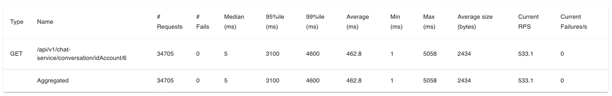
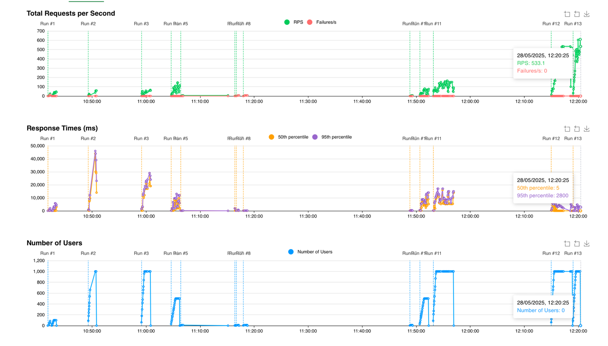
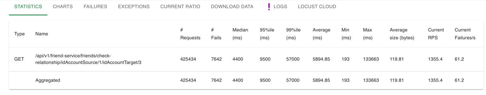
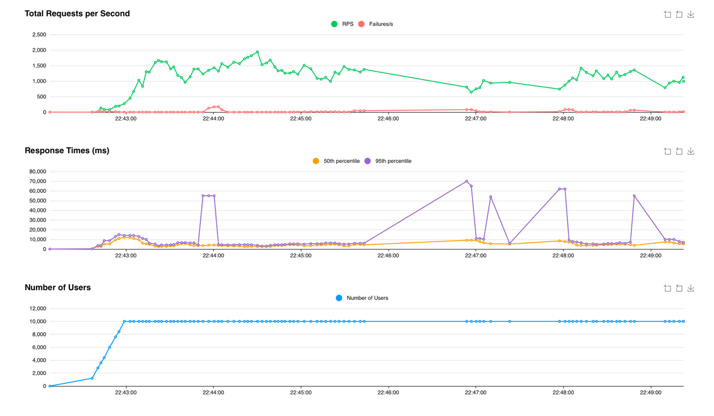

# 📊 Microservice Chat App - Load Test Report

## 🔌 WebSocket Test

> **STOMP over WebSocket** tại `ws://localhost:8081/ws-chat-native`  
> Kịch bản: Kết nối → Subscribe → Gửi 5 tin → Đợi 3s → Ngắt kết nối  
> ✅ **98.34% thành công** | ❌ **1.65% lỗi (status 101)**  
> ⏱ **Thời gian kết nối TB**: 438ms | Max: 6.01s  
> 📤 Gửi: 18,785 | 📥 Nhận: 95,436

---

## 🌐 HTTP API Test

  
*Biểu đồ chi tiết*

  
*Biểu đồ chi tiết*

> **Endpoint**: `/api/v1/chat-service/conversation/idAccount/6`  
> 👥 **Người dùng**: 1000 tổng | Ramp-up: 30 người/giây  
> 🔄 **34,705 yêu cầu** | ❌ **0 lỗi (0%)**  -> Rất tốt
> ⏳ **95th percentile**: 3,1s | **Max**: 5s  
> ⏳**Media** | 5ms -> Rất tốt

  
*Bảng mô tả tổng quan*

  
*Biểu đồ chi tiết*

> **Endpoint**: `/api/v1/friend-service/friends/check-relationship/idAccountSource/1/idAccountTarget/3`  
> 👥 **Người dùng**: 10,000 tổng | Ramp-up: 500 người/giây  
> 🔄 **494,668 yêu cầu** | ❌ **10,189 lỗi (2.06%)**  
> ⏳ **95th percentile**: 11s | **Max**: 133s  
> ⚠️ Độ trễ cao và tỷ lệ lỗi cần được tối ưu.

## 📌 Kế Hoạch Tiếp Theo
- Tìm nguyên nhân lỗi status 101 và HTTP timeout.
- Tối ưu hiệu suất hệ thống.
- Thử nghiệm thêm các API khác và mô phỏng tải cao hơn.

---
